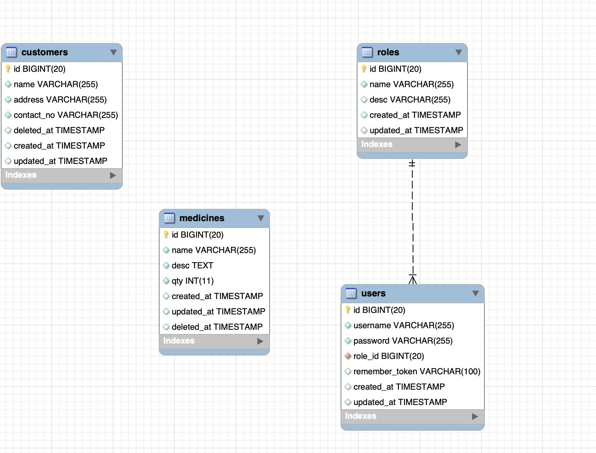

# Medi App Management Software

## About MediApp

A pharmacy with the stakeholders involved are the `owner`, `manager` and `cashier` requires a system to streamline its business processes, involving authentication, medication inventory management, and customer record management. The system needs to enforce user roles and permissions for different actions.

## ER Diagram /Data Base



## Deployment Steps

Follow these steps to deploy Medi App.

#### Step 01 - Clone Repository

Clone using the Web URL

```
git clone https://github.com/DDSameera/mediapp.git
```

#### Step 02 - Create .env file & Provide DB Credentials

```
APP_NAME=MediApp
APP_ENV=local
APP_KEY=base64:0E+aNuSoDkqt/0ZKmxWAklaEygSwgsTjx4trjgN2Joo=
APP_DEBUG=false
APP_URL=http://localhost

DB_CONNECTION=mysql
DB_HOST=xxxxx
DB_PORT=xxxxx
DB_DATABASE=xxxxxx
DB_USERNAME=xxxxx
DB_PASSWORD=xxxxxx

```

#### Step 03 - Run Composer Install

`composer install`

#### Step 04 - Setup Application key

`php artisan key:generate`

#### Step 05 - Run Migration with Mockup Data

`php artisan migrate:fresh --seed`

#### Step 06 - Optimize Data

```
php artisan optimize
php artisan optimize:clear

```

#### Step 07 - Import or Browse Postman Collection

[Postman API Documentation](https://documenter.getpostman.com/view/33331372/2sA2xb7bYu)

## Demo username & passwords

#### Superadmin Credentials

```

username : superadmin
password : superadmin

```

#### Owner Credentials

```

username : owner
password : owner

```

#### Manager Credentials

```
username : manager
password : manager
```

#### Cashier Credentials

```

username : cashier
password : cashier


```

## Used Design Patterns

-   Model View Controller
-   Facade
-   Singleton
-   Factory
-   Service Layer
-   Observer

## Used Best Practices

1. Class Names

```
class MedicineService {}
class MedicineController {}
```

2. File Names

```
MedicineService.php
CustomerService.php
```

3. Function Names with Camel Case
4. Database tables and Columns : All Table names are in plural nounds
5. Route Names are in Snake Case
6. use `Api/v1` to simplify maintenance. Developers have the flexibility to introduce newer versions like `v2`, `v3`
7. Added Comments for better understance
8. I followed principle of Single Responsibility, It is crucial for maintaining clean and maintainable code
